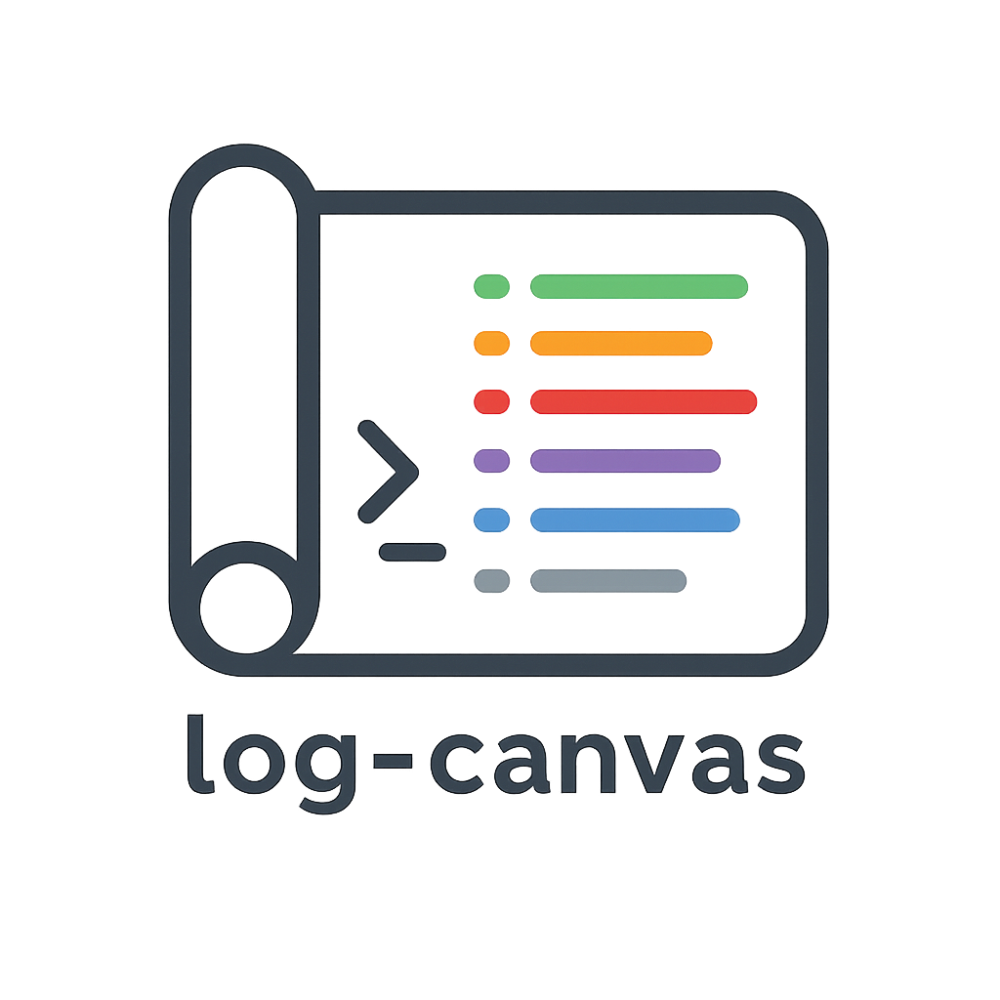
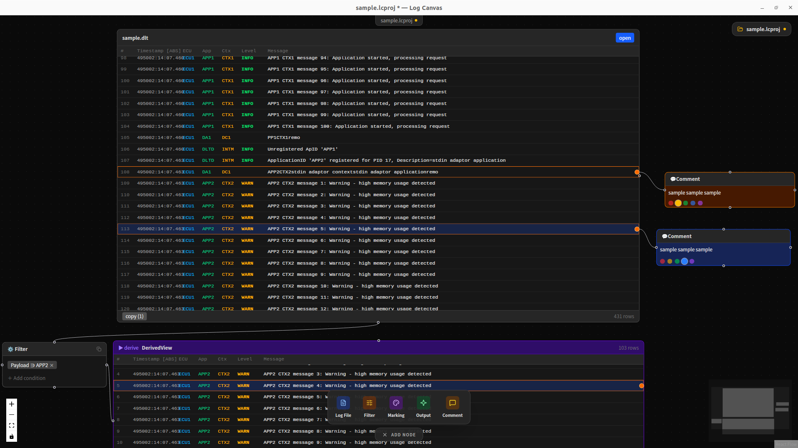

<div align="center">



# log-canvas

**An infinite canvas for log analysis — read, think, and annotate in one place.**

[](LICENSE)
[](https://tauri.app)
[](https://react.dev)
[](https://www.typescriptlang.org)
[](https://www.rust-lang.org)

</div>

---

## Overview

log-canvas is a desktop application that brings log analysis onto an infinite whiteboard. Instead of juggling a log viewer, a screenshot tool, and a separate note-taking app, you can open log files as resizable cards on a canvas, annotate them with sticky-note comments, filter or highlight specific lines, and save the entire workspace — all in one window.

> **Primary target:** DLT log analysis, but designed to be extensible to other log formats.



## Tech Stack

| Layer | Technology |
|---|---|
| Desktop shell | [Tauri 2](https://tauri.app) |
| Frontend | React 19 + TypeScript (Vite) |
| Styling | Tailwind CSS |
| Canvas | React Flow |
| Backend | Rust |
| Package manager | Bun |

## Prerequisites

- [Bun](https://bun.sh) 1.x
- [Rust](https://rustup.rs) (stable toolchain)
- Tauri system dependencies for your OS — see the [Tauri prerequisites guide](https://tauri.app/start/prerequisites/)

## Getting Started

```bash
# Clone the repository
git clone https://github.com/Gyabi/log-canvas.git
cd log-canvas

# Install frontend dependencies
bun install

# Start in development mode (hot-reload)
bun run tauri dev
```

### Build for production

```bash
bun run tauri build
```

Compiled installers are placed in `src-tauri/target/release/bundle/`.

## Development

```bash
# Type-check frontend
bun run build

# Lint TypeScript
bun run lint
bun run lint:fix

# Lint Rust
bun run lint:rs
bun run lint:rs:fix

# Regenerate Tauri command bindings
bun run gen-bindings
```

## Project Structure

```
log-canvas/
├── src/                  # React frontend
├── src-tauri/
│   ├── src/              # Rust backend
│   ├── capabilities/     # Tauri permission definitions
│   └── tauri.conf.json
├── docs/                 # Design documents & requirements
├── tools/                # Development utilities
│   └── dlt-sample-gen/   # DLT sample file generator
└── public/
```

## Tools

### `tools/dlt-sample-gen` — DLT Sample File Generator

Generates a real `.dlt` binary file using [dlt-daemon](https://github.com/COVESA/dlt-daemon) running inside Docker. Use this to produce test data for development without needing a real DLT-capable device.

**Requirements:** Docker + Docker Compose

```bash
cd tools/dlt-sample-gen
docker compose up --build
```

The generated file contains messages from multiple App IDs (APP1, APP2, NET, SYS) and Context IDs at various log levels (INFO, WARN, ERROR, FATAL, DEBUG, VERBOSE). The file follows the DLT Storage Format specification.

## Contributing

Contributions are welcome! Please open an issue before submitting a pull request to discuss what you'd like to change.

1. Fork the repository
2. Create a feature branch (`git checkout -b feature/your-feature`)
3. Commit your changes
4. Open a pull request

## License

Distributed under the MIT License. See [LICENSE](LICENSE) for details.
